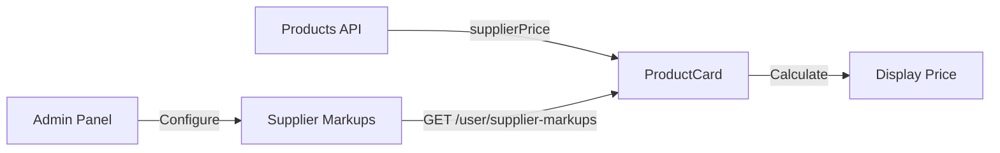

# Pricing Calculation Guide

This document explains how product prices are calculated and displayed to users in the Nexus platform.

## Overview

The final price a user sees is calculated using **Supplier Pricing** plus a configurable **Supplier Markup**. This allows the platform to profit from the difference between what suppliers charge and what users pay.

## Price Components

| Term                | Description                                  | Example |
| ------------------- | -------------------------------------------- | ------- |
| **Denom Amount**    | Face value of the product (what user "gets") | ₦700    |
| **Supplier Price**  | What the supplier charges us                 | ₦690    |
| **Supplier Markup** | Percentage added to supplier price           | 6.37%   |
| **Selling Price**   | Final price shown to user                    | ₦734    |

## Calculation Formula

```
Selling Price = Supplier Price × (1 + Markup Percentage)
```

### Example

```
Denom Amount:     ₦700 (face value)
Supplier Price:   ₦690 (our cost)
Markup:           6.37%

Selling Price = 690 × (1 + 0.0637)
              = 690 × 1.0637
              = ₦734
```

## Data Flow



### Step-by-Step Flow

1. **Admin configures Supplier Markup** at `/admin/dashboard/supplier-markups`
2. **Products API** returns products with `supplierOffers[].supplierPrice`
3. **`useSupplierMarkupMap` hook** fetches markups from `/user/supplier-markups`
4. **`ProductCard.tsx`** calculates selling price using the formula above
5. **User sees** the final calculated price

## Code References

### Markup Calculation (ProductCard.tsx)

```tsx
// Lines 40-48
const faceValue = parseFloat(product.denomAmount || "0");
const supplierOffer = product.supplierOffers?.[0];
const supplierPrice = supplierOffer
  ? parseFloat(supplierOffer.supplierPrice)
  : faceValue;

// Convert markup: if < 1 treat as decimal, else as percentage
const actualMarkup = markupPercent < 1 ? markupPercent : markupPercent / 100;
const baseSellingPrice = supplierPrice + supplierPrice * actualMarkup;
```

### Markup Data Source (useSupplierMarkup.ts)

```tsx
// Fetches from /user/supplier-markups
const { data: markupData } = useMarkup();

// Returns Map<supplierId, markupPercent>
markupData.markups.forEach((markup) => {
  map.set(markup.supplierId, markup.markupPercent);
});
```

## Discount Badge Logic

A "X% Off" badge is displayed when the selling price is **less than** the face value:

```tsx
// ProductCard.tsx Lines 64-78
if (baseSellingPrice < faceValue) {
  discountPercentage = Math.round(
    ((faceValue - baseSellingPrice) / faceValue) * 100
  );
}
```

### When Discount Shows

| Scenario                          | Badge Shows?    |
| --------------------------------- | --------------- |
| Selling ₦734 > Face ₦700          | ❌ No           |
| Selling ₦650 < Face ₦700          | ✅ Yes (7% Off) |
| Active Offer with discountedPrice | ✅ Yes          |

## Offer Discounts

When a product has an `activeOffer`, additional discount logic applies:

```tsx
const displayPrice =
  showDiscountedPrice && product.discountedPrice
    ? product.discountedPrice // Use offer's discounted price
    : baseSellingPrice; // Use calculated selling price
```

## Admin Configuration

### Setting Supplier Markups

1. Navigate to **Admin Dashboard > Supplier Markups**
2. Create a new markup rule for a supplier
3. Set the markup percentage (e.g., `6.37` for 6.37%)
4. All products from that supplier will have this markup applied

### Viewing Product Prices

- **Admin Products Page**: Shows denom amount (face value)
- **User Products Page**: Shows calculated selling price (with markup)

## Troubleshooting

### Price Higher Than Expected

**Cause**: Supplier markup is configured for the supplier.

**Solution**: Check `/admin/dashboard/supplier-markups` and verify the markup percentage.

### Discount Badge Not Showing

**Cause**: Selling price is greater than or equal to face value.

**Solution**: Discount badges only appear when `sellingPrice < faceValue`. Adjust supplier pricing or markup to create a discount effect.

### Wrong Price Displayed

**Debug Steps**:

1. Open browser DevTools Console
2. Look for `[useSupplierMarkupMap]` logs showing markup values
3. Verify the `supplierPrice` in the product data
4. Calculate: `supplierPrice × (1 + markup%) = expectedPrice`
