# Setup Flow Guide (Mobile Screen Flow)

This guide documents the post-login setup wizard flow for mobile users, including all steps, hooks, services, and types involved.

---

## 📱 Setup Flow Overview

After a successful login, users are directed to the **Setup Wizard** (`/setup`) which guides them through account security configuration.

```mermaid
flowchart TD
    A[Login Success] --> B{User has PIN?}
    B -->|No| C[Step 1: Set Transaction PIN]
    B -->|Yes| D{User has Passcode?}
    C --> D
    D -->|No| E[Step 2: Set App Passcode]
    D -->|Yes| F{Biometric Supported?}
    E --> F
    F -->|Yes & Not Configured| G[Step 3: Enable Biometric]
    F -->|No or Already Set| H[Finish → Dashboard]
    G --> H
```



---

## 🔐 Step 1: Transaction PIN Setup

**Purpose**: Required for authorizing payments and withdrawals.

### Validation Rules

| Field            | Rule                              | Error Message                    |
| ---------------- | --------------------------------- | -------------------------------- |
| PIN              | Exactly 4 digits                  | `"PIN must be 4 digits"`         |
| PIN              | Only numeric                      | `"PIN must contain only digits"` |
| Confirm PIN      | Must match PIN                    | `"PINs do not match"`            |
| Current Password | Required if updating existing PIN | `"Current password is required"` |

### Component

**File**: `src/components/features/security/set-pin-form.tsx`

```tsx
import { SetPinForm } from "@/components/features/security/set-pin-form";

<SetPinForm onSuccess={() => console.log("PIN set!")} />;
```

### Hook

**File**: `src/hooks/useUser.ts`

```tsx
import { useSetPin } from "@/hooks/useUser";

const { mutate: setPin, isPending } = useSetPin();

setPin(
  { pin: "1234", currentPassword: "password123" }, // currentPassword only if updating
  {
    onSuccess: () => {
      /* handle success */
    },
    onError: (error) => {
      /* handle error */
    },
  }
);
```

### Service

**File**: `src/services/user.service.ts`

```tsx
// API: PUT /user/profile/pin
userService.setPin({ pin: string, currentPassword?: string })
```

### Types

**File**: `src/types/user.types.ts`

```tsx
interface SetPinRequest {
  pin: string;
  currentPassword?: string; // Required if PIN already set
}
```

---

## 🔑 Step 2: App Passcode Setup (6-digit)

**Purpose**: Used for soft-lock/session revalidation when returning to the app.

### Validation Rules

| Field            | Rule                | Error Message                         |
| ---------------- | ------------------- | ------------------------------------- |
| Passcode         | Exactly 6 digits    | `"Passcode must be 6 digits"`         |
| Passcode         | Only numeric        | `"Passcode must contain only digits"` |
| Confirm Passcode | Must match passcode | `"Passcodes do not match"`            |

### Hook

**File**: `src/hooks/usePasscode.ts`

```tsx
import { useSetPasscode, useVerifyPasscode } from "@/hooks/usePasscode";

// Set passcode
const { mutate: setUserPasscode, isPending } = useSetPasscode();
setUserPasscode(
  { passcode: "123456", currentPasscode: "654321" }, // currentPasscode only if updating
  {
    onSuccess: () => {
      /* handle success */
    },
    onError: (error) => {
      /* handle error */
    },
  }
);

// Verify passcode (for unlock)
const { mutate: verifyPasscode } = useVerifyPasscode();
verifyPasscode(
  { passcode: "123456", intent: "unlock" }, // intent: "unlock" | "revalidate" | "transaction"
  {
    onSuccess: () => {
      /* handle success */
    },
    onError: (error) => {
      /* handle error */
    },
  }
);
```

### Service

**File**: `src/services/user.service.ts`

```tsx
// API: POST /user/profile/passcode
userService.setPasscode({ passcode: string, currentPasscode?: string })
```

---

## 👆 Step 3: Biometric Setup (Optional)

**Purpose**: Enables Face ID / Touch ID / Windows Hello for faster login.

### Checking Support

```tsx
import { WebAuthnService } from "@/services/webauthn.service";

const isSupported = await WebAuthnService.isWebAuthnSupported();
```

### Hook

**File**: `src/hooks/useBiometric.ts`

```tsx
import {
  useBiometricRegistration,
  useBiometricAuthentication,
  useBiometricEnrollments,
  useRevokeEnrollment,
  useBiometricTransaction,
} from "@/hooks/useBiometric";

// Register new biometric
const { mutate: registerBiometric, isPending } = useBiometricRegistration();
registerBiometric("iPhone 15", {
  onSuccess: () => {
    /* handle success */
  },
  onError: (error) => {
    /* handle error */
  },
});

// Authenticate with biometric
const { mutate: authenticateBiometric } = useBiometricAuthentication();

// List user's enrolled devices
const { data: enrollments } = useBiometricEnrollments(true);

// Revoke an enrollment
const { mutate: revokeEnrollment } = useRevokeEnrollment();
revokeEnrollment({ id: "enrollment-id", reason: "Lost device" });

// Verify biometric for transactions
const { mutateAsync: verifyForTransaction } = useBiometricTransaction();
const token = await verifyForTransaction();
```

### Service

**File**: `src/services/webauthn.service.ts`

```tsx
class WebAuthnService {
  // Check support
  static async isWebAuthnSupported(): Promise<boolean>

  // Registration flow
  static async getRegistrationOptions(): Promise<any>
  static async createCredential(options: any): Promise<any>
  static async verifyCredential(credential: any, deviceInfo?: {...}): Promise<any>

  // Authentication flow
  static async getAuthenticationOptions(): Promise<AuthenticationOptionsResponse>
  static async signAssertion(options: any, mediation?: any, signal?: AbortSignal): Promise<any>
  static async verifyAssertion(assertion: any): Promise<any>

  // Helpers
  static getDeviceInfo(): { platform: string; deviceName: string; userAgent: string }
}
```

### Types

**File**: `src/types/biometric.types.ts`

```tsx
interface BiometricEnrollment {
  id: string;
  user_id: string;
  device_id: string;
  device_name: string;
  platform: "ios" | "android" | "macos" | "windows" | "web" | "unknown";
  authenticator_attachment: "platform" | "cross-platform";
  is_active: boolean;
  enrolled_at: string;
  last_verified_at?: string;
  verification_count: number;
}

interface AuthenticationOptionsResponse {
  challenge: string;
  rpId?: string;
  timeout?: number;
  userVerification?: string;
  allowCredentials?: Array<{
    id: string;
    type: string;
    transports?: string[];
  }>;
}
```

---

## 🧩 Complete Setup Wizard Component

**File**: `src/components/features/auth/setup-wizard.tsx`

### Usage

```tsx
import { SetupWizard } from "@/components/features/auth/setup-wizard";

export default function SetupPage() {
  return (
    <div className="flex min-h-screen items-center justify-center p-4">
      <SetupWizard />
    </div>
  );
}
```

### State Management

The wizard uses a `SetupStep` type to track progress:

```tsx
type SetupStep = "loading" | "pin" | "passcode" | "biometric" | "finish";
```

### Local Storage Keys

| Key                       | Purpose                                                                |
| ------------------------- | ---------------------------------------------------------------------- |
| `biometric_prompt_status` | Tracks if biometric was enabled or skipped (`"enabled"` / `"skipped"`) |
| `passcode_prompt_status`  | Tracks passcode setup status (`"enabled"`)                             |
| `is_setup_done`           | Indicates setup is complete (`"true"`)                                 |

### Dependencies

```tsx
import { useAuth } from "@/hooks/useAuth";
import { useBiometricRegistration } from "@/hooks/useBiometric";
import { useBiometricType } from "@/hooks/useBiometricType";
import { useSetPasscode } from "@/hooks/usePasscode";
import { WebAuthnService } from "@/services/webauthn.service";
```

---

## 📊 User Profile (hasPin & hasPasscode)

The user object contains status flags to check security setup:

```tsx
interface User {
  id: string;
  email: string;
  phoneNumber?: string;
  fullName?: string;
  hasPin: boolean; // Has transaction PIN set
  hasPasscode?: boolean; // Has app passcode set
  // ...other fields
}
```

### Accessing User

```tsx
import { useAuth } from "@/hooks/useAuth";

const { user, isLoading } = useAuth();

if (!user?.hasPin) {
  // Redirect to PIN setup
}
```

---

## 🔗 API Endpoints Summary

| Action                   | Method   | Endpoint                      |
| ------------------------ | -------- | ----------------------------- |
| Set/Update PIN           | `PUT`    | `/user/profile/pin`           |
| Set/Update Passcode      | `POST`   | `/user/profile/passcode`      |
| Get Registration Options | `POST`   | `/biometric/register/options` |
| Verify Registration      | `POST`   | `/biometric/register/verify`  |
| Get Auth Options         | `POST`   | `/biometric/auth/options`     |
| Verify Authentication    | `POST`   | `/biometric/auth/verify`      |
| List Enrollments         | `GET`    | `/biometric/enrollments`      |
| Revoke Enrollment        | `DELETE` | `/biometric/enrollments/:id`  |

---

## 🎨 UI Components Used

| Component            | Path                                          | Purpose                                     |
| -------------------- | --------------------------------------------- | ------------------------------------------- |
| `PinInput`           | `@/components/pin-input`                      | Digit input for PIN/Passcode                |
| `SetPinForm`         | `@/components/features/security/set-pin-form` | Full PIN form with validation               |
| `SmartBiometricIcon` | `@/components/ui/smart-biometric-icon`        | Shows Face ID/Touch ID icon based on device |
| `Spinner`            | `@/components/ui/spinner`                     | Loading indicator                           |

---

## 📱 Mobile Screen Flow Diagram

```
┌─────────────────────┐
│    Login Screen     │
│  ┌───────────────┐  │
│  │ Email/Phone   │  │
│  │ Password      │  │
│  │ [Login]       │  │
│  └───────────────┘  │
└──────────┬──────────┘
           ▼
┌─────────────────────┐
│   STEP 1: Set PIN   │
│  ┌───────────────┐  │
│  │ [•][•][•][•]  │  │
│  │ New PIN       │  │
│  │               │  │
│  │ [•][•][•][•]  │  │
│  │ Confirm PIN   │  │
│  │               │  │
│  │   [Set PIN]   │  │
│  └───────────────┘  │
└──────────┬──────────┘
           ▼
┌─────────────────────┐
│ STEP 2: Passcode    │
│  ┌───────────────┐  │
│  │    🔒         │  │
│  │[•][•][•][•][•][•]│
│  │ New Passcode   │  │
│  │               │  │
│  │[•][•][•][•][•][•]│
│  │ Confirm        │  │
│  │               │  │
│  │[Set Passcode] │  │
│  └───────────────┘  │
└──────────┬──────────┘
           ▼
┌─────────────────────┐
│ STEP 3: Biometric   │
│  ┌───────────────┐  │
│  │    👆/👤      │  │
│  │               │  │
│  │ Enable faster │  │
│  │ login with    │  │
│  │ biometrics    │  │
│  │               │  │
│  │[Enable FaceID]│  │
│  │[Skip for now] │  │
│  └───────────────┘  │
└──────────┬──────────┘
           ▼
┌─────────────────────┐
│     Dashboard       │
│  ┌───────────────┐  │
│  │   Welcome!    │  │
│  │   Balance: ₦0 │  │
│  └───────────────┘  │
└─────────────────────┘
```
